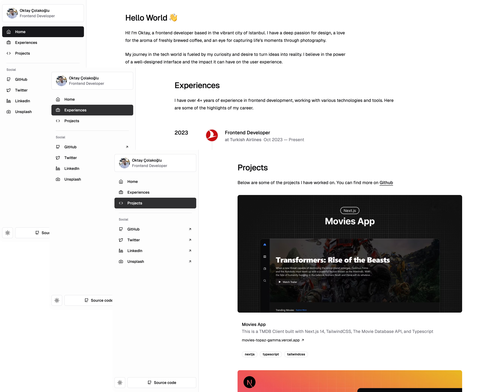

# Personal Website

This project is a personal website built with [Next.js](https://nextjs.org/), [TypeScript](https://www.typescriptlang.org/), [Tailwind CSS](https://tailwindcss.com/), and [shadcn/ui](https://github.com/shadcn/ui). The content is managed using [DatoCMS](https://www.datocms.com/). The website showcases my work experience and projects.

## Screenshot



## Features

- Dynamic content management using DatoCMS
- Pages displaying work experiences and projects
- Responsive design
- Fast and modern user interface

## Installation

Clone the repository:

```bash
git clone https://github.com/oktay/oktay-2024.git
cd personal-website
```

Install the dependencies:

```bash
npm install
```

## Setting Up DatoCMS

1. Create an account on [DatoCMS](https://www.datocms.com/) and set up a new project.
2. Add the necessary models and fields for your content (e.g., Work Experience, Projects).
3. Obtain your DatoCMS API token and set it in your environment variables:

Create a `.env.local` file in the root of your project and add the following:

```plaintext
NEXT_DATOCMS_API_TOKEN="your-datocms-api-token"
```

## Starting the Development Server

To start the development server:

```bash
npm run dev
```

Open [http://localhost:3000](http://localhost:3000) with your browser to see the result. The page will automatically reload if you make changes to the code.

## Building for Production

To build the application for production:

```bash
npm run build
```

This command will create an optimized build in the `.next` folder.


## Technologies Used

- [Next.js](https://nextjs.org/) - React framework
- [TypeScript](https://www.typescriptlang.org/) - Typed superset of JavaScript
- [Tailwind CSS](https://tailwindcss.com/) - Utility-first CSS framework
- [shadcn/ui](https://github.com/shadcn/ui) - UI components library
- [DatoCMS](https://www.datocms.com/) - Headless CMS for content management

## Contributing

If you would like to contribute, please open a pull request or submit an issue. Contributions and feedback are welcome.

## License

This project is licensed under the MIT License. See the `LICENSE` file for more information.

---

Feel free to customize this according to your project's specifics. Happy coding!
